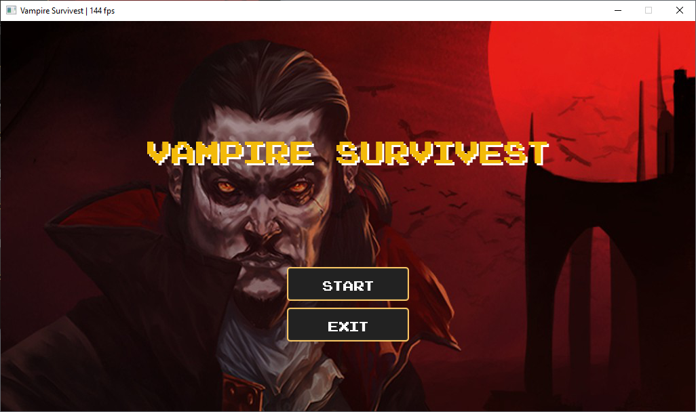
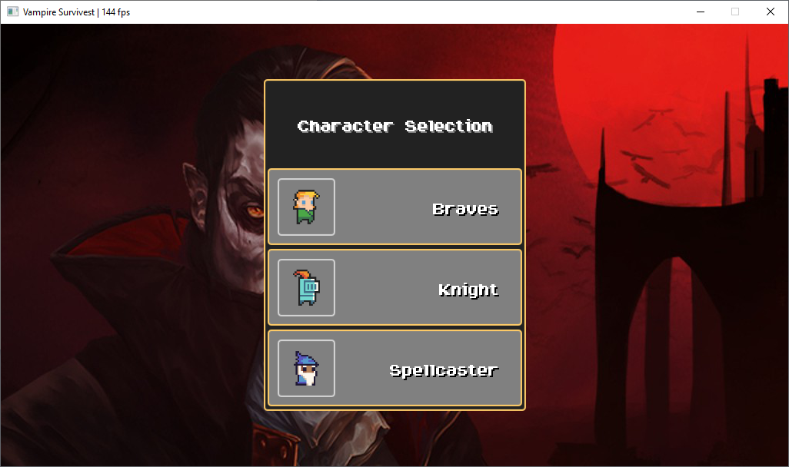
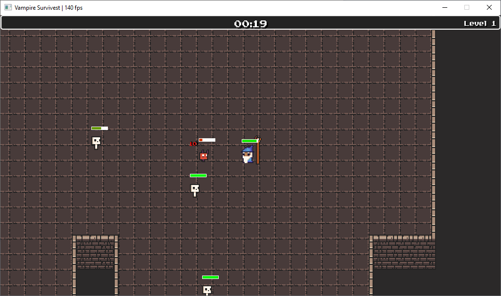
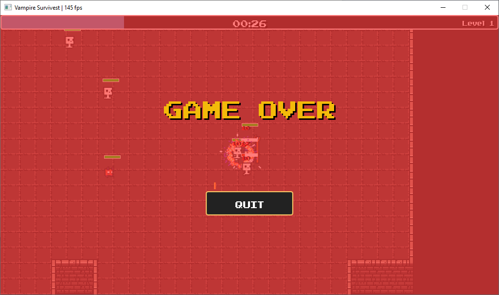

# Vampire Survivest
- **Vampire Survivest** is a final project of Programming Methodology subject at Chulalongkorn University. 
- As the name shown, Vampire Survivest is a remake of the original game, **Vampire Survivor**.
- 3 playable characters: Braves, Knight, and Spellcaster.
- 2 hostile entities: Undead, Imp.

### Main Menu

### Character Selection

### Game Play

### Game Over

## Reference
- DungeonTieset II by **0x72** [https://0x72.itch.io/dungeontileset-ii](https://0x72.itch.io/dungeontileset-ii)
- Pixel Art Effect by **FX084** [https://nyknck.itch.io/fx084](https://nyknck.itch.io/fx084)
- Wind Spell Effect 01 by  **pimen** [https://pimen.itch.io/wind](https://pimen.itch.io/wind)
- Five Free Pixel Explosions by **unTied Games** [https://untiedgames.itch.io/five-free-pixel-explosions](https://untiedgames.itch.io/five-free-pixel-explosions)
- 8-bit / 16-bit Sound Effects (x25) Pack by **JDWasabi** [https://jdwasabi.itch.io/8-bit-16-bit-sound-effects-pack](https://jdwasabi.itch.io/8-bit-16-bit-sound-effects-pack)
- RPG Essentials SFX by **Leohpaz** [https://leohpaz.itch.io/rpg-essentials-sfx-free](https://leohpaz.itch.io/rpg-essentials-sfx-free)
- Minifantasy - Dungeon Audio Pack by **Leohpaz** [https://leohpaz.itch.io/rpg-essentials-sfx-free](https://leohpaz.itch.io/rpg-essentials-sfx-free)
- Arcadepix font by **Reekee of Dimenzioned** [https://www.dafont.com/arcadepix.font](https://www.dafont.com/arcadepix.font)